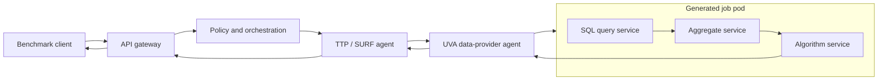
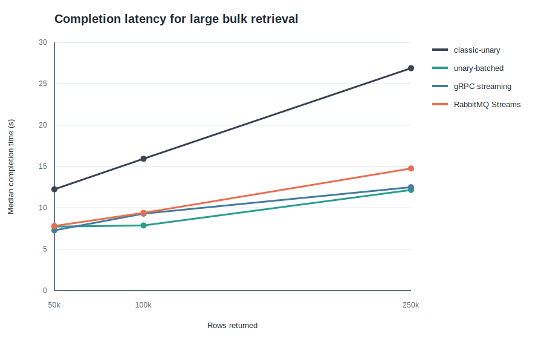
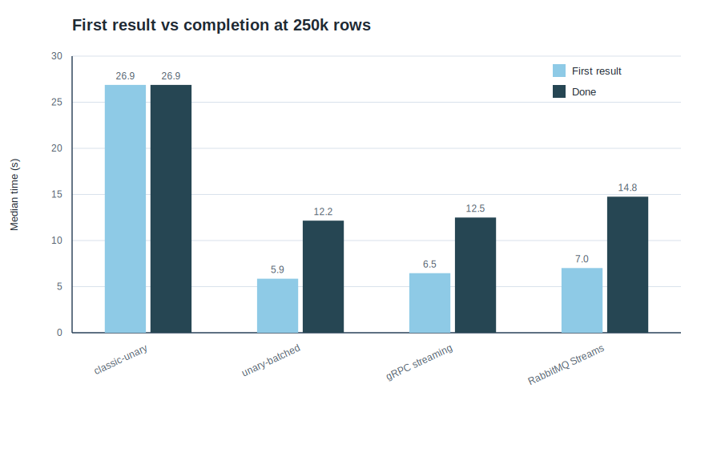
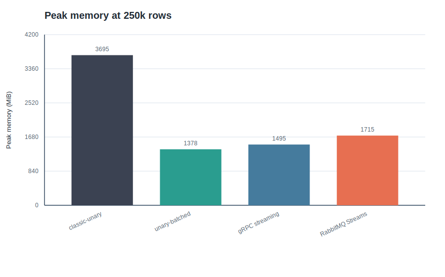

# RQ2 Draft: Streaming and Batching in DYNAMOS

Working research question:

> How can DYNAMOS be extended with chunked data-transfer techniques, and how do these techniques perform compared with the original classic unary implementation for large result sets?

This draft treats RQ2 as an implementation and evaluation question. The central claim is that DYNAMOS' original large-result bottleneck is not only a configurable gRPC message-size issue, but also an architectural buffering issue: the original data path moves a complete result as one message. The implemented chunked variants change that behavior by dividing large SQL result sets into smaller row batches and moving those batches through the system before the complete result is available.

## Problem Context

DYNAMOS is a policy-driven middleware for data exchange systems. A request is first evaluated by the DYNAMOS control plane, after which DYNAMOS dynamically deploys the microservice chain needed to execute the selected data-exchange archetype. In the `dataThroughTtp` archetype used here, the request passes through a trusted third party (TTP) and a data-provider agent. The data-provider agent deploys a generated Kubernetes job containing the SQL query service and supporting microservices. The result is then routed back through the DYNAMOS communication path to the requester.

The original DYNAMOS implementation already identified large data transfers as a limitation. The DYNAMOS thesis states that the default maximum gRPC message size is around 4 MB, which corresponded to approximately 30,000 records in the original experiments. It also notes that the implementation used unary RPCs, meaning that a client sends one request and receives one response, and that raising the message size limit is possible but memory-heavy. Streaming was explicitly named as a possible solution, but was left for future work due to time constraints. This makes large-result transfer a natural extension point for this thesis: the original system can be made to pass bigger messages by increasing limits, but doing so keeps the same whole-result buffering behavior.

The motivation for testing bulk retrieval is different from the original average-query example. An average query is a reduction workload: the system may read many rows, but it returns a single aggregate value. That is useful for testing computation near the data source, but it does not represent cases where a downstream workflow needs many aligned records. Vertical federated learning (VFL), for example, often involves multiple parties holding complementary features for the same entities. A training workflow may therefore need to move embeddings, aligned feature rows, labels, gradients, or intermediate model data rather than only a single scalar result. For that reason, this evaluation uses a bulk projection query in `dataThroughTtp` instead of only an average query.

## Pipeline And Transport Points

The benchmarked request path can be summarized as follows.

The implementation changes three different streaming scopes, which should be kept separate in the thesis:

1. Provider-side chunking: the SQL query service reads the database result and emits row batches instead of one complete table.
2. In-pod microservice transport: chunks move through the generated job's microservice chain, either as repeated unary messages or through a client-side gRPC stream.
3. Inter-agent and response transport: chunks move across agent queues and are exposed to the benchmark client as NDJSON `providerResult` events.

This distinction matters because "streaming" is not one single mechanism. Unary-batched, gRPC streaming, and RabbitMQ Streams all use chunks, but they differ in where the chunks are transported and how tightly the sender and receiver are coupled.

## Implementations

### Classic Unary Baseline

The classic unary baseline uses the original DYNAMOS `main` branch behavior. The SQL service produces a complete result, and the result is transferred as one logical response through the microservice chain. This is the closest comparison to the original DYNAMOS implementation. For the benchmark, the gRPC/message-size limits were configured high enough that the baseline could complete 50k, 100k, and 250k row requests. This avoids an unfair comparison where the baseline fails only because of the historical 4 MB ceiling.

This baseline remains intentionally full-buffered. It is important for the thesis to state that classic unary is not expected to have good memory behavior at larger row counts. Its purpose is to represent the original style of DYNAMOS data transfer when the message-size ceiling is removed.

### Unary-Batched

Unary-batched keeps the existing DYNAMOS communication style but changes the payload shape. The SQL query service emits result chunks of 5,000 rows. Each chunk is forwarded through the DYNAMOS path as a separate message with stream metadata such as sequence number, row count, final/partial markers, and ordered column metadata. The aggregate and algorithm stages pass non-average bulk chunks through without rebuilding the whole table, while `classicUnary` remains the switch for the full-buffer baseline.

This variant is architecturally attractive because it preserves much of the original decoupled DYNAMOS design. It does not require a long-lived gRPC stream between every producer and consumer. Instead, it uses smaller messages over the existing request path, which reduces memory pressure while staying close to the original DYNAMOS operational model.

### gRPC Streaming

The gRPC streaming variant uses the same provider-side chunks, but sends chunks with the same correlation ID through a long-lived `SendDataStream` call inside the microservice chain. This gives stronger streaming semantics than repeated unary calls: one logical stream can carry many chunks, and the receiver can process chunks as they arrive.

The tradeoff is architectural. A long-lived gRPC stream couples sender and receiver lifetime more tightly than message-by-message transfer. That is not automatically wrong, and the performance is competitive in the benchmark, but it is less aligned with DYNAMOS' broader emphasis on decoupled, dynamically composed services. This should be discussed as a design tradeoff rather than only as a performance number.

### RabbitMQ Streams

RabbitMQ Streams extends chunking into the broker-backed communication path. Large microservice communications crossing agent ingress queues can be split into RabbitMQ stream records and reassembled on the receiving side. This is the most interesting option for distributed deployments because it fits DYNAMOS' decoupling story: the broker can absorb message flow, records are durable, and producer/consumer lifetimes do not need to align as tightly as with a direct gRPC stream.

The current prototype, however, pays for that decoupling with overhead. The benchmark shows higher CPU peaks and slower completion at 250k rows than unary-batched and gRPC streaming. Therefore, RabbitMQ Streams should be positioned as promising for future distributed/FABRIC experiments, not as the local default implementation yet.

## Benchmark Method

The benchmark evaluates large bulk SQL retrieval in the `dataThroughTtp` archetype. Each request uses a bulk projection query over the large Personen and Aanstellingen tables and limits the result to 50,000, 100,000, or 250,000 rows. The provider set is `UVA`, so the comparison focuses on transport behavior rather than multi-provider fanout.

Four implementations are compared:

| implementation | branch / source | response behavior |
| --- | --- | --- |
| classic-unary | `main`, commit `747912e` | one full result response |
| unary-batched | `feature/rabbitmq-streams`, commit `923b018` | chunked result over repeated unary-style messages |
| gRPC streaming | `feature/rabbitmq-streams`, commit `923b018` | chunked result over long-lived gRPC stream |
| RabbitMQ Streams | `feature/rabbitmq-streams`, commit `923b018` | chunked result over RabbitMQ stream records |

Each configuration was run 10 times using warm repetitions. The benchmark validates row counts, content hashes, raw result hashes, partial-result counts, and resource samples. For the chunked variants, `--require-partial` was used so that a run only counts as valid if it emits partial result chunks before completion. Resource metrics were sampled from Kubernetes across the relevant namespaces and summarized as peak total CPU millicores and peak total memory.

There is one important methodology caveat. The classic unary baseline required the generated `surf` and `uva` jobs to be cleaned between repetitions. Without that cleanup, later repetitions returned fast 502 or empty-provider responses because stale generated jobs were still present. The cleaned baseline should therefore be treated as the valid comparison, and the cleanup behavior should be documented because it affects reproducibility.

## Results

### Completion Latency

The main result is that all three chunked variants reduce median completion latency compared with classic unary.

| implementation | 50k rows | 100k rows | 250k rows |
| --- | ---: | ---: | ---: |
| classic-unary | 12.240s | 15.939s | 26.880s |
| unary-batched | 7.731s | 7.870s | 12.158s |
| gRPC streaming | 7.278s | 9.299s | 12.495s |
| RabbitMQ Streams | 7.809s | 9.394s | 14.756s |

At 250k rows, unary-batched is 2.21x faster than classic unary, gRPC streaming is 2.15x faster, and RabbitMQ Streams is 1.82x faster. The 100k result is especially favorable to unary-batched, which finishes in 7.870s compared with 15.939s for classic unary. The 50k result is closer, but still shows a clear advantage for the chunked designs.

### Time To First Result

Classic unary cannot emit an intermediate result: its first result is also its final result. The chunked variants can return partial results earlier.

| implementation | rows | first result median | done median | median partial chunks |
| --- | ---: | ---: | ---: | ---: |
| classic-unary | 50,000 | 12.240s | 12.240s | 0 |
| classic-unary | 100,000 | 15.939s | 15.939s | 0 |
| classic-unary | 250,000 | 26.880s | 26.880s | 0 |
| unary-batched | 50,000 | 7.186s | 7.731s | 9 |
| unary-batched | 100,000 | 6.054s | 7.870s | 19 |
| unary-batched | 250,000 | 5.857s | 12.158s | 49 |
| gRPC streaming | 50,000 | 6.522s | 7.278s | 9 |
| gRPC streaming | 100,000 | 7.682s | 9.299s | 19 |
| gRPC streaming | 250,000 | 6.459s | 12.495s | 49 |
| RabbitMQ Streams | 50,000 | 6.915s | 7.809s | 9 |
| RabbitMQ Streams | 100,000 | 6.737s | 9.394s | 19 |
| RabbitMQ Streams | 250,000 | 7.014s | 14.756s | 49 |

This is an important qualitative difference. Even when total completion times are close, the chunked variants expose progress earlier and avoid waiting for one complete result table before the client sees any data. For interactive workflows, monitoring, or downstream consumers that can process data incrementally, time-to-first-result may be as important as total completion time.

### Resource Usage

Peak memory improves consistently with chunking.

| implementation | rows | peak CPU | peak memory |
| --- | ---: | ---: | ---: |
| classic-unary | 50,000 | 782m | 1,571 MiB |
| classic-unary | 100,000 | 813m | 2,046 MiB |
| classic-unary | 250,000 | 1,198m | 3,695 MiB |
| unary-batched | 50,000 | 403m | 1,151 MiB |
| unary-batched | 100,000 | 469m | 1,723 MiB |
| unary-batched | 250,000 | 1,097m | 1,378 MiB |
| gRPC streaming | 50,000 | 351m | 1,198 MiB |
| gRPC streaming | 100,000 | 479m | 1,230 MiB |
| gRPC streaming | 250,000 | 1,418m | 1,495 MiB |
| RabbitMQ Streams | 50,000 | 457m | 1,161 MiB |
| RabbitMQ Streams | 100,000 | 982m | 1,436 MiB |
| RabbitMQ Streams | 250,000 | 1,687m | 1,715 MiB |

At 250k rows, classic unary reaches 3,695 MiB peak memory. Unary-batched stays at 1,378 MiB, gRPC streaming at 1,495 MiB, and RabbitMQ Streams at 1,715 MiB. This supports the main design claim: chunking reduces memory pressure because the system no longer needs to hold the entire result in every stage as one large message.

CPU should be interpreted more carefully. Unary-batched uses slightly less peak CPU than classic unary at 250k rows, but gRPC streaming and RabbitMQ Streams peak higher. This is plausible because chunking trades large-buffer memory pressure for more coordination work: more messages, more metadata handling, more serialization boundaries, and, for RabbitMQ Streams, broker stream record handling and reassembly. The conclusion should therefore avoid claiming that chunking universally reduces all resource use. The stronger claim is that chunking improves latency and memory, while CPU depends on transport overhead.

## Discussion

The benchmark answers RQ2 positively: DYNAMOS can be extended with chunked data-transfer techniques, and those techniques outperform the original classic unary implementation for large bulk result retrieval in this setup. The result is not only that 250k rows can complete, but that they complete with lower median latency, much lower peak memory, and visible partial progress.

Unary-batched is the strongest current default candidate. It has the best median completion time at 100k and 250k rows, and the lowest 250k memory peak in this run. More importantly, it fits DYNAMOS' architecture well. It preserves the existing decoupled message-driven style while avoiding the original single-message bottleneck. For a thesis conclusion, this is a strong argument: the best default is not necessarily the most theoretically "streaming" design, but the one that improves the bottleneck while disrupting the architecture the least.

gRPC streaming is also a strong technical result. It is close to unary-batched at 250k rows and slightly faster at 50k rows. Its advantage is cleaner stream semantics inside the microservice chain: the chain can treat the result as one logical stream of chunks rather than many separate messages. Its disadvantage is that long-lived streams couple producer and consumer lifetimes more tightly. In an adaptive microservice system where jobs and chains are dynamically composed, that coupling is a real architectural concern. It should be presented as a promising alternative, especially for tightly controlled in-pod communication, but not automatically as the best DYNAMOS-wide default.

RabbitMQ Streams is the most architecturally interesting for distributed deployments. It matches DYNAMOS' decoupling goals better than direct gRPC streams and may be more appropriate when providers and TTPs run on different nodes or sites. However, in the local concept benchmark it is slower at 250k rows and has the highest CPU peak. That does not make the design a failure. It means the current prototype is paying overhead for durability and broker-mediated decoupling that is not fully rewarded in a local single-provider setup. This makes RabbitMQ Streams a better candidate for RQ3-style distributed scalability experiments than for the local default in RQ2.

## Conclusion For RQ2

The original DYNAMOS implementation was limited by large unary messages: around 4 MB / 30,000 rows under the original default gRPC configuration, and high memory use when that limit is raised. This thesis extends DYNAMOS with chunked transfer mechanisms that keep the bulk result as a sequence of smaller row batches. In the `dataThroughTtp` benchmark, all chunked variants beat classic unary in median completion latency and peak memory for 50k, 100k, and 250k rows.

The best current DYNAMOS default is unary-batched. It gives the strongest 100k and 250k latency results, the lowest 250k memory peak, and the smallest architectural shift from the original message-driven DYNAMOS design. gRPC streaming remains valuable where true stream semantics inside a microservice chain are desired, but its long-lived connection model is less aligned with decoupled dynamic composition. RabbitMQ Streams is promising for distributed inter-agent deployments, but its current local overhead means it should be evaluated further under RQ3 rather than selected as the default based only on the local benchmark.

## RQ3 Bridge

The Scattered Directive work extends DYNAMOS toward distributed, reproducible deployments and VFL workflows. The Scattered Directive paper describes an extension of DYNAMOS with cross-node microservice chains and a VFL-oriented archetype, Shared Execution via a Trusted Third Party. The Scattered Directive repository describes the project as an automated framework for deploying DYNAMOS on the FABRIC research infrastructure, including requesting nodes, configuring nodes, and deploying DYNAMOS with the relevant relations defined.

This makes FABRIC a natural next environment for RQ3. FABRIC is designed for programmable distributed infrastructure with compute, storage, and high-speed dedicated network links across multiple sites. A local Kubernetes benchmark can show that chunking improves DYNAMOS' large-result behavior, but it cannot show how the variants behave under real cross-node latency, broker placement, network throughput limits, or multi-party VFL-style coordination.

Possible RQ3 wording:

> How do DYNAMOS streaming variants scale when data providers and the trusted third party are deployed across distributed FABRIC nodes under VFL-like workflows?

The RQ3 benchmark should add metrics that matter more in distributed settings: completion time, time-to-first-result, peak memory, CPU, network throughput, broker lag or stream backlog, failure recovery behavior, and concurrent-job scaling. RabbitMQ Streams should receive special attention there, because its decoupling and durability properties may become more valuable when the system is no longer a local single-cluster deployment.

## Suggested Figures And Tables

Use one architecture figure early in the section. A simplified version of `docs/diagrams/architecture/job-example.drawio.png` or `docs/images/archive/dynamos/job-dataThroughTtp.drawio.png` would fit well, but redraw it with the chunking points marked clearly:

- SQL provider emits 5,000-row chunks.
- Aggregate and algorithm process chunks instead of rebuilding the whole result.
- Gateway emits NDJSON partial `providerResult` events.
- RabbitMQ Streams only applies to the broker/agent path, not to every in-pod message.

Recommended result visuals:

1. Line chart: median completion time vs row count for all four implementations.
2. Bar chart: peak memory at 250k rows.
3. Optional bar chart: time-to-first-result at 250k rows.
4. Optional speedup table: unary-batched 2.21x, gRPC streaming 2.15x, RabbitMQ Streams 1.82x at 250k rows.

## Citation And Source Notes

Use these as citation handles when moving the draft into the thesis:

- DYNAMOS original thesis: `docs/papers/DYNAMOS_Thesis_J_Stutterheim.pdf`. Useful sections: 4.4.1 on gRPC message size and unary RPC behavior, 7.4.1 on the 4 MB / 30,000 row limit and streaming as unfinished future work.
- DYNAMOS repository: `https://github.com/neburpoots/DYNAMOS`, with `main` commit `747912e` for the classic baseline and `feature/rabbitmq-streams` commit `923b018` for the chunked variants.
- Scattered Directive paper: `C:\Users\nebur\Downloads\Vertical_Federated_Learning_on_Scattered_Directive_Enforcing_Policies_on_VFL_Workflows.pdf`. Useful pages: page 2 for Scattered Directive extending DYNAMOS with cross-node microservice chains and using FABRIC, pages 4-5 for Shared Execution via TTP and VFL workflow design, pages 7-8 for conclusions and future work.
- Scattered Directive repository: `https://github.com/DYNAMOS-UVA/Scattered-Directive`.
- FABRIC overview: `https://portal.fabric-testbed.net/about/about-fabric` and `https://fabric-testbed.org/`.
- Benchmark artifacts:
  - Classic baseline: `benchmark-results/concept-20260524-main-classic-10rep-cleaned/`.
  - Streaming/batched direct transports: `benchmark-results/concept-20260524-streaming-clean-focused/direct-transports-50k-100k-250k-10rep/`.
  - Unary 100k rerun: `benchmark-results/concept-20260524-streaming-clean-focused/unary-100k-10rep-rerun/`.
  - RabbitMQ 100k and 250k reruns: `benchmark-results/concept-20260524-streaming-clean-focused/rabbitmq-100k-10rep-rerun-after-smoke/` and `benchmark-results/concept-20260524-streaming-clean-focused/rabbitmq-250k-10rep-rerun-after-100k/`.

## Limitations To Keep In The Thesis

This is concept-stage evidence, not the final benchmark campaign. The comparison is much fairer than comparing against a baseline that simply fails at 4 MB, because classic unary was configured to complete larger requests. However, it remains an implementation comparison between two branches, so the thesis should document the exact commits, configuration, cleanup behavior, row counts, and benchmark runner versions.

The resource metrics are peak sampled values rather than full profiler traces. They are useful for comparing memory pressure, but final thesis work could strengthen the resource analysis with higher-frequency sampling, per-namespace breakdowns, and network metrics. For RQ3, distributed metrics such as throughput, broker lag, and queue backlog will become more important than in this local run.
